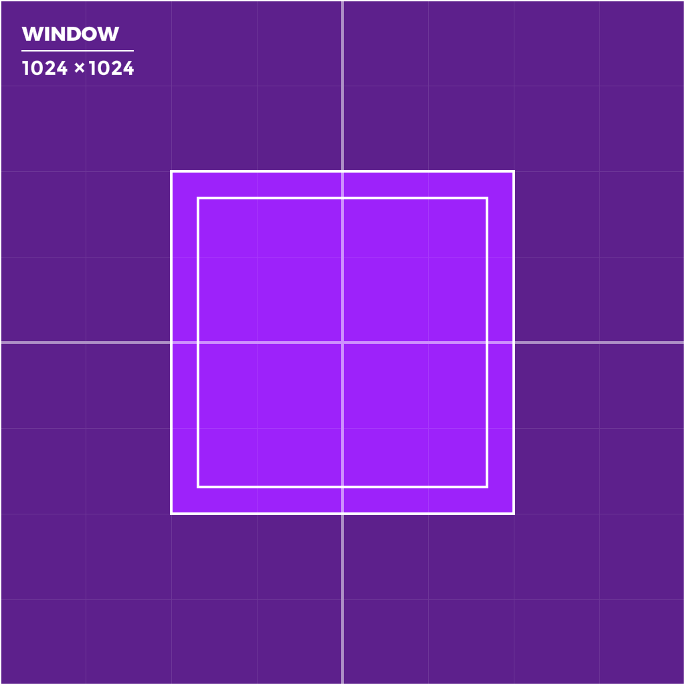
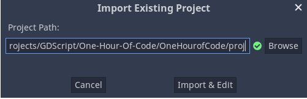
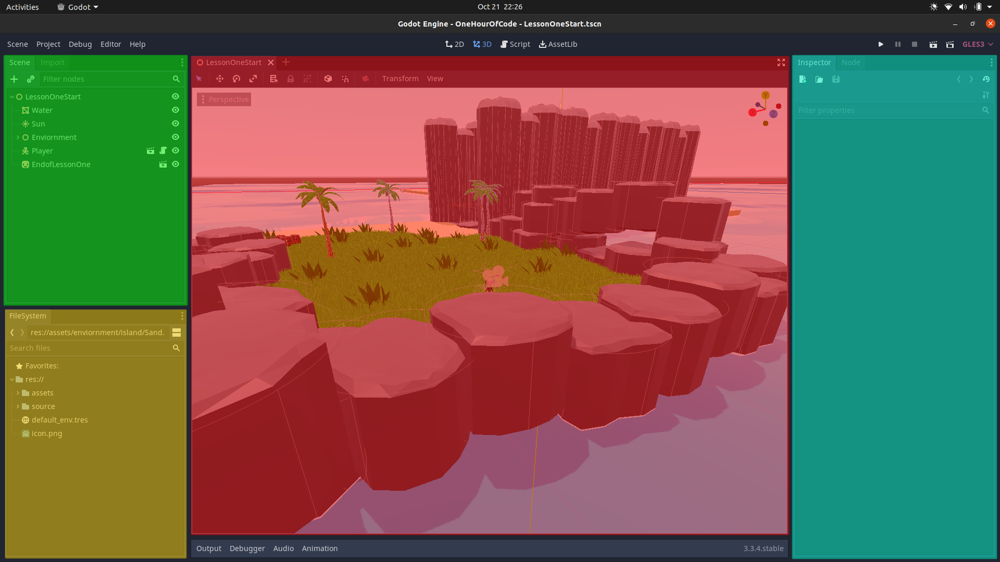

[#1](https://app.gitkraken.com/glo/view/card/0dad7b687ca64ab3bb18413fcaada3c1)
[#2](https://app.gitkraken.com/glo/view/card/a16497bb1e194616b9207831df998458)
# BREAKING DOWN 3D GAME DEVELOPMENT
## Overview
### Learn Collision Detection with Godot Game Engine
In this lesson, you will learn how to build a simple parkour course to get the player through a hallway, and to a closeby island. You will learn about collision detection and how important it is in computer programming, especially game development. You will also have a chance to get familiar with navigating the Godot Game Engine user interface, more specifically the Viewport. You will explore the interface in order to modify objects to include collision detection and place objects throughout the level to develop the game world.

You can make the parkour course as easy or difficult as you like. Be mindful that difficulty does not always equal fun. You may think your level is too easy to complete, but this may be because you are the designer and have played through your level many times. Be sure to take all the feedback from your play-testers very seriously, because this will make your game more enjoyable for a wider group of players. The more play-testers you work with, the more successful your game will become.

---
## Learning Enviornment
This lesson is designed as an introductory lesson on 3D game development. The lesson does not require any prior knowledge of making games. It can be used as a stand-alone lesson, or in conjunction with other activities to complete a larger project.

Required Software:
 - Godot Game Engine version 3.3.x or better
 - Hour of Code Project Files

---
## About
| LESSON TITLE    | Breaking Down 3D Game Development                |
|-----------------|--------------------------------------------------|
| CONTENT         | Learn Collision Detection with Godot Game Engine |
| TIME_FRAME      |    ~ 1 Hour                                      |
| AUTHOR          | GameDevone                                       |
| CONTACT EMAIL   | gamedevone1@gmail.com                            |
| CONTACT TWITTER | @gamedevone1                                     |

---
## Learning Objectives
 - Demonstrate an understanding of collision detection as a concept.
 - Apply the understanding of collision detection in the context of a game.
 - Create and modify a game level in a true game engine (Godot Game Engine) that incorporates the use of collision detection.


---
## Godot User Interface
Before you can begin creating the game you must understand how to navigate around the Godot Game Engine.

When you first launch Godot you will see the Project Manager [Figure 1](#figure-1---project-manager). Since you have no projects there will be a popup asking if you want to open the asset library, just click cancel, we'll look at it later. 

Now you should see the Project Manager. It lets you create, remove, import, or play game projects.

##### *Figure 1 - Project Manager*


You can import existing projects using the **Import** button on the right. **Browse** for the Hour of Code folder that contains the project. Select the folder called 'proj' and open the `project.godot` file. When the folder path is correct, you'll see a green checkmark [Figure 2](#figure-2---import-existing-project). Select **Import & Edit** to see the main project.

##### *Figure 2 - Import Existing Project*


**Welcome to Godot!** With your project open, you should see the Editor's Interface [Figure 3](#figure-3---godot-editor-interface) with menus along the top of the interface and panels docked along the far extremes of the interface on either side of the viewport.
 - **Scene Dock (*Green*)** lists the active scene's node structure.
   - All objects created in your game will be shown here as an expanded/collasped tree.
 - **Filesystem Dock (*Yellow*)**  is where you'll manage your project files and assets. 
   - Files can be dragged and dropped onto the Filesystem Dock to add them to the project.
 - **Viewport (*Red*)** is where you can work with meshes, lights, and design levels for 3D games.
   - While the mouse is hovering over the viewport can press `Shift+F` to move around the world with Minecraft like controls. Press `Shift+F` to exit that navigation mode as well.
     - **W** = Move Forward
     - **A** = Move Left
     - **S** = Move Backward
     - **D** = Move Right
     - **Q** = Move Down
     - **E** = Move Up
     - **Mouse Movement**  = Look around 
 - **Inspector Dock (*Blue*)** is where you will edit the properties of each selected Node.
   - The term **Node** is used to identify the various objects or elements that are in a Scene.
 - **Main Menu, Workspaces, Playtest (*Purple*)** is where you will change project settings, work in 2D or 3D and begin playing the game. 

##### *Figure 3 - Godot Editor Interface*


---
## Let's Play
Let’s jump right in! Click the `Play` button at the top-right of the screen, or press `F5`. Close the window or press `F8` to return to the Editor.


You can use the mouse to look around, and use the following buttons to move:
 - **W** = move forward
 - **A** = move left
 - **S** = move right
 - **D** = move backward
 - **Space** = jump

---
## Activity 1
a. Try to get to the end of the tunnel. What happened?
```


```
b. What do you think needs to be fixed to make the game playable?
```


```

---
## Collision Detection

You’ll notice that your character falls through the platform in the tunnel, and lands at the bottom of the pit. This is because the platform has no collision associated with it, it is only being drawn visibly in the world. The game doesn’t yet know that the player should be able to stand on this platform. Let's create a **Static Body** for the platform to correct that bug.

1. In the Filesystem Dock, find the `WaterDock.tscn` and double click to open it. This will bring up a new scene in the Viewport and show the hierarchy of nodes in the Scene Dock. If you cannot see the waterdock in the Viewport:
   1.  Click the `"WaterDock"` Node in the Scene dock
   2.  Hover the mouse over the Viewport 
   3.  Press `F` to bring the viewport focus to the object


2. In the Scene Dock select the `"Platform"` Node.
3. At the top of the Viewport select the menu tab 'Mesh'.
4. Select `Create Trimesh Static Body`.


A static body is one that is not moved by the physics engine. It participates in collision detection, but does not move in response to the collision. They are most often used for objects that are part of the environment or that do not need to have any dynamic behavior. Trimesh is the pattern Godot uses to automatically create the collision shape for the mesh.

There are a total of 4 types of physics bodies that Godot offers:
 - Area
 - Static
 - Rigid
 - Kinematic

The **Static Body** works perfectly for our case because we do not want the `WaterDock` Node to do anymore than be a platform the player can stand on.

Once you have followed the steps above you should see a very thing blue outline surrounding the platform. In the Scene Dock there will be two nodes that were added as children to the `Platform` Node. One is the `Static Body` Node and the other is the `Collision Shape` Node. Each physics body needs a collision shape as a child to define what area is being affected by physics.


Now its time to check if collision works correctly in the game.
Play the game and check if the player can jump onto the platform.

---
## Player Collision


