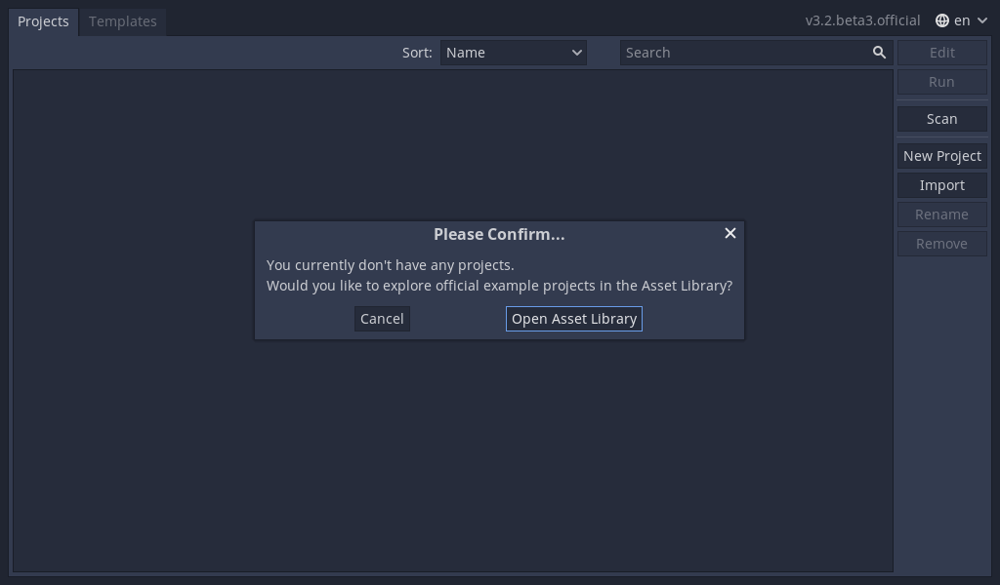
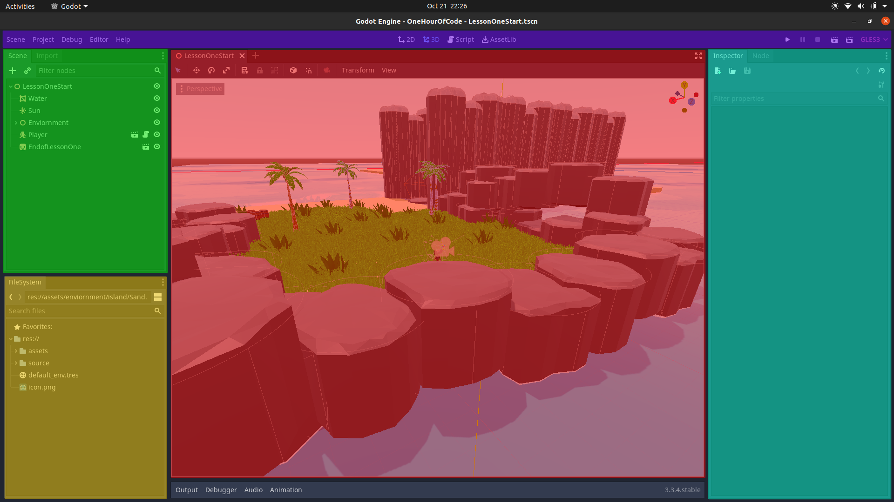

 # BREAKING DOWN 3D GAME DEVELOPMENT


## Table of Contents
- [Overview](#overview)
- [About](#about)
- [Learning Enviornment](#learning-enviornment)
- [Learning Objectives](#learning-objectives)
- [Godot User Interface](#godot-user-interface)
- [Let's Play](#lets-play)
  - [Activity 1](#activity-1)
- [Collision Detection](#collision-detection)
  - [Activity 2](#activity-2)
- [Adding more Platforms with Duplicate](#adding-more-platforms-with-duplicate)
- [Player Collision](#player-collision)
- [Showstopper Bugs](#showstopper-bugs)
- [Building a Parkour Course](#building-a-parkour-course)
- [Challenge](#challenge)
- [Game Design Fun](#game-design-fun)
- [What's Next](#whats-next)
- [Issues](#issues)


## Overview
### Learn Collision Detection with Godot Game Engine
In this lesson, you will learn how to build a simple parkour course to get the player through a hallway, and to a closeby island. You will learn about collision detection and how important it is in computer programming, especially game development. You will also have a chance to get familiar with navigating the Godot Game Engine user interface, more specifically the Viewport. You will explore the interface in order to modify objects to include collision detection and place objects throughout the level to develop the game world.

You can make the parkour course as easy or difficult as you like. Be mindful that difficulty does not always equal fun. You may think your level is too easy to complete, but this may be because you are the designer and have played through your level many times. Be sure to take all the feedback from your play-testers very seriously, because this will make your game more enjoyable for a wider group of players. The more play-testers you work with, the more successful your game will become.


## About
| LESSON TITLE    | Breaking Down 3D Game Development                |
|-----------------|--------------------------------------------------|
| CONTENT         | Learn Collision Detection with Godot Game Engine |
| TIME_FRAME      |    ~ 1 Hour                                      |
| AUTHOR          | GameDevone                                       |
| CONTACT EMAIL   | gamedevone1@gmail.com                            |
| CONTACT TWITTER | @gamedevone1                                     |


## Learning Enviornment
This lesson is designed as an introductory lesson on 3D game development. The lesson does not require any prior knowledge of making games. It can be used as a stand-alone lesson, or in conjunction with other activities to complete a larger project.

Required Software:
 - Godot Game Engine version 3.3.x or better
 - Hour of Code Project Files


## Learning Objectives
 - Demonstrate an understanding of collision detection as a concept.
 - Apply the understanding of collision detection in the context of a game.
 - Create and modify a game level in a true game engine (Godot Game Engine) that incorporates the use of collision detection.

>


## Godot User Interface
Before you can begin creating the game you must understand how to navigate around the Godot Game Engine.

When you first launch Godot you will see the Project Manager [Figure 1](#figure-1---project-manager). Since you have no projects there will be a popup asking if you want to open the asset library, just click cancel, we'll look at it later. 

Now you should see the Project Manager. It lets you create, remove, import, or play game projects.

>##### *Figure 1 - Project Manager*
>

You can import existing projects using the **Import** button on the right. **Browse** for the Hour of Code folder that contains the project. Select the folder called `proj` and open the `project.godot` file. When the folder path is correct, you'll see a green checkmark [Figure 2](#figure-2---import-existing-project). Select **Import & Edit** to see the main project.

>##### *Figure 2 - Import Existing Project*
>

**Welcome to Godot!** With your project open, you should see the Editor's Interface [Figure 3](#figure-3---godot-editor-interface) with menus along the top of the interface and panels docked along the far extremes of the interface on either side of the viewport.
 - **Scene Dock (*Green*)** lists the active scene's node structure.
   - All objects created in your game will be shown here as an expanded/collasped tree.
 - **Filesystem Dock (*Yellow*)**  is where you'll manage your project files and assets. 
   - Files can be dragged and dropped onto the Filesystem Dock to add them to the project.
 - **Viewport (*Red*)** is where you can work with meshes, lights, and design levels for 3D games.
   - While the mouse is hovering over the viewport can press `Shift+F` to move around the world with Minecraft like controls. Press `Shift+F` to exit that navigation mode as well.
     >- **W** = Move Forward
     >- **A** = Move Left
     >- **S** = Move Backward
     >- **D** = Move Right
     >- **Q** = Move Down
     >- **E** = Move Up
     >- **Mouse Movement**  = Look around 
 - **Inspector Dock (*Blue*)** is where you will edit the properties of each selected Node.
   - The term **Node** is used to identify the various objects or elements that are in a Scene.
 - **Main Menu, Workspaces, Playtest (*Purple*)** is where you will change project settings, work in 2D or 3D and begin playing the game. 

>##### *Figure 3 - Godot Editor Interface*
>


## Let's Play
Let’s jump right in! Click the `Play` button at the top-right of the screen, or press `F5`. Close the window or press `F8` to return to the Editor.

>

>You can use the mouse to look around, and use the following buttons to move:
 >- **W** = move forward
 >- **A** = move left
 >- **S** = move right
 >- **D** = move backward
 >- **Space** = jump


### Activity 1
a. Try to get to the end of the tunnel. What happened?
```


```
b. What do you think needs to be fixed to make the game playable?
```


```


## Collision Detection
>

In game development, you often need to know when two objects in the game intersect or come into contact. This is known as **collision detection**. When a collision is detected, you typically want something to happen. This is known as **collision response**.

You’ll notice that your character falls through the platform in the tunnel, and lands at the bottom of the pit. This is because the platform has no physics object associated with it. The platform is only being drawn visibly in the world, and the game doesn’t yet know that the player should be able to stand on this platform. 

Let's create a **Static Body** for the platform to correct that bug.

1. In the Filesystem Dock, find the `WaterDock.tscn` and double click to open it. This will bring up a new scene in the Viewport and show the hierarchy of nodes in the Scene Dock. If you cannot see the waterdock in the Viewport:
   1.  Click the `"WaterDock"` Node in the Scene dock
   2.  Hover the mouse over the Viewport 
   3.  Press `F` to bring the viewport focus to the object

>After selecting the Node you may see a Red, Blue and Green thing in the center of the object. That is called a *3D Gizmo* and we will understand how that works later in the project.

>

2. In the Scene Dock select the `"Platform"` Node.
3. At the top of the Viewport select the menu tab 'Mesh'.
4. Select `Create Trimesh Static Body`.
   
>
> A static body is one that is not moved by the physics engine. It participates in collision detection, but does not move in response to the collision. They are most often used for objects that are part of the environment or that do not need to have any dynamic behavior. Trimesh is the pattern Godot uses to automatically create the collision shape for the mesh.
>
>There are a total of 4 types of physics bodies that Godot offers:
> - Static
> - Kinematic
> - Rigid
> - Area

>
>The **Static Body** works perfectly for our case because we do not want the `WaterDock` Node to do anymore than be a platform the player can stand on.

Once you have followed the steps above you should see a very thing blue outline surrounding the platform. In the Scene Dock there will be two nodes that were added as children to the `Platform` Node. One is the `Static Body` Node and the other is the `Collision Shape` Node. Each physics body needs a collision shape as a child to define what area is being affected by physics.

>

Now its time to check if collision works correctly in the game.
Play the game and check if the player can jump onto the platform.


### Activity 2
a. What other objects in the game do you believe have a Static Body?
```


```
b. What do you think the Area, Rigid and Kinematic Bodies would be used for in game?
```


```


## Adding more Platforms with Duplicate

Great work! You should have the player landing on the first platform. Now we need to complete this hallway so the player can safely reach the other side. As a Game Developer, you need to think about efficient ways to accomplish tasks. That way it will take less time to complete projects and will likely result in better projects. In this case, we are going to use a shortcut that quickly copies our platform so we can place the platforms needed to get across the hallway.

1. In the Filesystem Dock find the `LessonOneStart.tscn` scene and double click to open it. 
2. In the Scene Dock, click the arrow next to the `Environment` Node to expand it and see its children.
3. Do the same again but for the `Answers` Node. The `WaterDock` Node we added collision to should be there.
4. Bring the Viewport to focus on that `WaterDock`. As a reminder here are the steps to bring an object into focus on the Viewport:
   1.  Click the `"WaterDock"` Node in the Scene dock
   2.  Hover the mouse over the Viewport 
   3.  Press `F` to bring the viewport focus to the object
   > View of the object maybe obstructed by other objects in the scene. You can use the `Scroll Wheel` by **scrolling up to zoom** or **click and drag the scroll wheel to rotate**, until you have the object in view.
5. Press `Ctrl+D` to duplicate the `WaterDock` Node. It will look like nothing has changed on the Viewport. If you look in the Scene Dock under the initial `WaterDock` Node you should see a new Node selected called `WaterDock2`. When objects are duplciated they are placed on top of the original object that was copied.
6. Click and drag the 3D Gizmo in the Viewport to move the `WaterDock2` Node to a new location. 
    >
7. We can duplicate the platform a few more times to create a parkour path across the pit.

Once you have a few platforms in place, test your level to see if you can get across.

>


## Player Collision
Collision detection occurs between two physics bodies. In the case of the previous section, it was between the Platform and Player. You created the **Rigid Body** for the Platform but the Player already had a physics body beforehand the **Kinematic Body**.

1. In the Filesystem Dock find the `Player.tscn` and open it.
2. If needed, bring focus onto the `Player` Node.

Let's take note of the Player's node structure. The player is a Kinematic Body with 4 children:
   - `Model` is the mesh being drawn in-game for the player
   - `CollisionShape` is a capsule shape that defines the hitbox. This is not the only shape that a CollisionShape can be. Capsules do a pretty good job of covering the entire body of the Model without any excess space.
   - `StateMachine` controls the different actions the Player can perform such as running and jumping.
   - `CameraRig` controls the 3rd person view and follows behind the Player as they move around the world.

>

A **Kinematic Body** detect collisions with other bodies but does not have an explicit response to colliding with another object. Instead, they must be controlled by the user via code. This is where the `StateMachine` takes control of the Player and provides the appropriate collision response while the player makes an action. After a collision, you may want the Player to bounce, slide along a wall, grab and hold an item, or alter the properties of the object it hit.

>To see all of the collision shapes in the game:
>  1. Select Debug in the Main Menu Panel
>  2. Click Visible Collision Shapes
>
> This is a great debugging tool to see if your collisions are working correctly in the game. If there are a considerable amount of collision shapes in your game you may see a drop in performance when playing it. But do not worry the shapes will not show up when you turn your game into an executable.

Out of all of the physics bodies, the **Kinematic Body** is best suited for player characters due to its versatility. The player will interact with many different objects in the game which will warrant a variety of responses. The other types of physics bodies would limit the type of interactions the player could have in the game.


### Activity 3
a. What are actions a Player take in game that would require collision?
```


```
b. What do you think would happen if the Player used a Static Body instead of a Kinematic Body?
```


```


## Showstopper Bugs
### Falling into the Void


## Building a Parkour Course


## Challenge


## What's Next


## Issues
- [ ] []()
- [ ] [#19 Create Screenshot of Player in Editor](https://app.gitkraken.com/glo/view/card/53d72293e5f04f34b5d06ad24200f341)
- [ ] [#18 Create Completed Parkour Path for Hallway screenshot](https://app.gitkraken.com/glo/view/card/eb2a0f4ea267402fbef5a887340703ed)
- [ ] [#17 Create Gizmo Dragging New Object screenshot](https://app.gitkraken.com/glo/view/card/a2f3b3717309422296fed2b0a49b99b5)
- [ ] [#16 Create Platform with Trimesh Static Body Added screenshot](https://app.gitkraken.com/glo/view/card/eeb3ed96d8724fe7b3b29332c7cea0e6)
- [ ] [#15 Create Create Trimesh Static Body option screenshot](https://app.gitkraken.com/glo/view/card/656952fba9724210ace6abd805886b69)
- [ ] [#14 Create WaterDock.tscn screenshot](https://app.gitkraken.com/glo/view/card/3ba4f139dc4e4698859f97f074341052)
- [ ] [#13 Create Player at First Jump screenshot](https://app.gitkraken.com/glo/view/card/682731cfc64441b2a335d6cb82c66855)
- [ ] [#12 Create Screenshot of Gameplay](https://app.gitkraken.com/glo/view/card/ed32ecf7cd2544b280f23b7d700b8f49)
- [ ] [#11 Clip the edges off of Figure 2](https://app.gitkraken.com/glo/view/card/9e8717123b4a4e52822bc8b17dca0072)
- [ ] [#10 Create Code, Design, Art, Audio and Production Artwork](https://app.gitkraken.com/glo/view/card/b7329181a657448d92d626166c029267)
- [ ] [#9 Write new section What's Next](https://app.gitkraken.com/glo/view/card/5ab7734abde74e5a834f28d3c6ab51ab)
- [ ] [#7 Write new section Challenge](https://app.gitkraken.com/glo/view/card/725a3189bde04f6aa104b6b332a607d9)
- [ ] [#6 Write a new section Creating a Parkour Course](https://app.gitkraken.com/glo/view/card/aa362fbcc5244401b2e88e1007bb988d)
- [ ] [#5 Write new section Showstopper Bugs](https://app.gitkraken.com/glo/view/card/06bd082118bd45e3a552f6a4706560c0) 
- [x] [#4 Write new section Player Collision](https://app.gitkraken.com/glo/view/card/7ce51ca7eba5402c888bc830652efcfd)
- [ ] [#2 Create Cover Page Art](https://app.gitkraken.com/glo/view/card/a16497bb1e194616b9207831df998458)